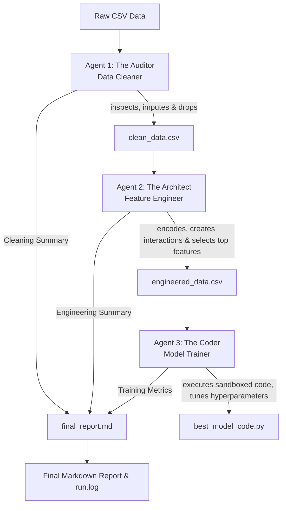

# 🤖 The Multi-Agent AutoML Team

An intelligent, multi-agent AutoML pipeline designed to automatically audit, clean, engineer, train, and report on tabular datasets. Powered by OpenAI's function calling API, the system divides the complex task of building a machine learning pipeline among three specialized autonomous agents.

---

## 🏗️ Architecture & Workflow

The pipeline runs sequentially, passing intermediate datasets and text summaries from one agent to the next to build on each other's work.



---

## 👥 Meet the Agents

### 1. 🧹 Agent 1 — Data Cleaner ("The Auditor")
* **Role:** Audits the raw dataset to detect and resolve data quality issues.
* **Capabilities:** 
  * Inspects dataset metadata (shapes, data types, null percentages).
  * Automatically imputes missing values using median (for numeric columns with <30% missing) or mode (for categorical columns with <30% missing).
  * Safely drops columns with high missing rates (>60%) or identifiers (cardinality equals row count, free-text names, ticket codes).
* **Output:** `outputs/clean_data.csv`

### 2. 📐 Agent 2 — Feature Engineer ("The Architect")
* **Role:** Maximizes the predictive signal in the cleaned data for the specified target label.
* **Capabilities:**
  * Categorical encoding (One-hot encoding for low cardinality, Label encoding for high cardinality).
  * Feature interaction creation (generates mathematical ratios and interaction columns using pandas `.eval()`).
  * Calculates Pearson correlations with the target column.
  * Selects the top $k$ (usually 5–8) features with the strongest correlation.
* **Output:** `outputs/engineered_data.csv`

### 3. 🧠 Agent 3 — Model Trainer ("The Coder")
* **Role:** Trains, evaluates, and optimizes a predictive model.
* **Capabilities:**
  * Writes self-contained Python training scripts utilizing XGBoost.
  * Runs training scripts in a sandboxed execution environment.
  * Captures accuracy, F1 score, and recall.
  * Tunes hyperparameters (estimators, max depth, learning rate, subsampling, and class weights) over multiple iterations.
* **Output:** `outputs/best_model_code.py`

---

## 📁 Repository Structure

```
├── agents/
│   ├── agent1_cleaner.py     # Data cleaning agent
│   ├── agent2_engineer.py    # Feature engineering agent
│   └── agent3_trainer.py     # Model training & tuning agent
├── data/
│   └── titanic.csv           # Default sample dataset
├── tools/
│   ├── __init__.py
│   └── agent_tools.py        # Shared tool functions executed by agents
├── outputs/                  # Auto-generated by pipeline
│   ├── clean_data.csv        # Staged clean data
│   ├── engineered_data.csv   # Staged engineered data
│   ├── best_model_code.py    # Executable code for the best model
│   └── final_report.md       # Consolidated Markdown execution report
├── logs/
│   └── run.log               # Detailed execution traces
├── .env.example              # Environment variables template
├── .gitignore
├── requirements.txt          # Python dependencies
├── main.py                   # Main pipeline orchestrator
└── README.md                 # Project documentation
```

---

## 🚀 Getting Started

### 📋 Prerequisites

Ensure you have Python 3.8+ installed.

### ⚙️ Installation & Setup

1. **Clone the repository:**
   ```bash
   git clone https://github.com/kilasoniatekla777/-The_Multi_Agent_AutoML_Team.git
   cd -The_Multi_Agent_AutoML_Team
   ```

2. **Create and activate a virtual environment:**
   ```bash
   python3 -m venv venv
   source venv/bin/activate
   ```

3. **Install dependencies:**
   ```bash
   pip install -r requirements.txt
   ```

4. **Configure your API keys:**
   Copy the example environment file and add your OpenAI API key:
   ```bash
   cp .env.example .env
   ```
   Open `.env` and fill in your API key:
   ```env
   OPENAI_API_KEY=your-actual-api-key-here
   ```

### 🏃 Running the Pipeline

Execute the orchestrator script using python:

```bash
# Run with default settings (Titanic dataset, Target: "Survived")
python main.py

# Run on a custom dataset
python main.py --csv path/to/your_data.csv --target TargetColumnName
```

---

## 📊 Pipeline Deliverables

Upon completion, the pipeline generates the following assets:
* **`outputs/final_report.md`**: A summary comparing column counts at each stage, detailing the transformations done by the Data Cleaner and Feature Engineer, and showcasing the performance metrics and hyperparameters of the best model.
* **`outputs/best_model_code.py`**: A fully reproducible Python script containing the configuration of the winning model.
* **`logs/run.log`**: A log of the step-by-step reasoning processes and tool executions of all three agents.
